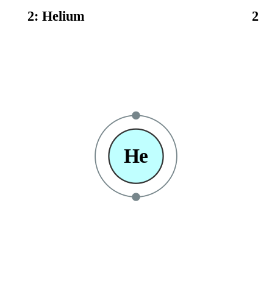

=$= Title
PICUP Exercise Template J72335918

=$= Author

=$= Description
Description or abstract.

=$= LearningObjectives
Learning Objectives

=$= InstructorGuide
Instructor's Guide Section

=$= Theory
Theory Section

=$= Exercises
1. Exercise 1
2. Exercise 2
3. Exercise 3
4. Exercise 4

=$= Pseudocode
Pseudocode 1.

Pseudocode 2.

=$= Solutions
1. Solution 1
2. Solution 2
3. Solution 3
4. Solution 4

=$= TextbookConnections
Physics Textbooks Sections